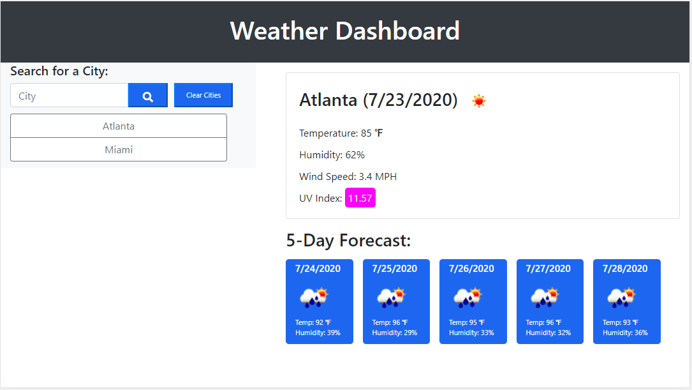

# Weather_Dashboard



## User Story

```
AS A traveler
I WANT to see the weather outlook for multiple cities
SO THAT I can plan a trip accordingly
```

## Acceptance Criteria

```
GIVEN a weather dashboard with form inputs
WHEN I search for a city
THEN I am presented with current and future conditions for that city and that city is added to the search history
WHEN I view current weather conditions for that city
THEN I am presented with the city name, the date, an icon representation of weather conditions, the temperature, the humidity, the wind speed, and the UV index
WHEN I view the UV index
THEN I am presented with a color that indicates whether the conditions are favorable, moderate, or severe
WHEN I view future weather conditions for that city
THEN I am presented with a 5-day forecast that displays the date, an icon representation of weather conditions, the temperature, and the humidity
WHEN I click on a city in the search history
THEN I am again presented with current and future conditions for that city
WHEN I open the weather dashboard
THEN I am presented with the last searched city forecast
```

The following image was given to demonstrate the application functionality:


## Approach Taken
- Began by creating base HTML, CSS, and JavaScript files to begin.
- Added the following elements to HTML file.
    - Created links to Bootstrap CSS in addition to custom css file.
    - Linked FontAwesome to unlock icons desired for search button.
    - Created static header using bootstrap to provide background color.
    - Created container with the ID of search to place elements related to cities to be searched. 
        - Populated above container with text input field, Submit/search button, and clear city button.
        - Added div with the ID of prevCities to populate buttons onces a city is searched. 
    - Created container with the ID of weather that will hold forecast related elements.
        - Set this display class to none using bootstrap so that no borders would be seen prior to search.
        - Created container with the ID of currentCityWeather to add current weather elements retrieved from API call. 
        - Created container with the ID of fiveDayForecast to add five day forecast elements. 
            - Created div with class of row for forecast header to be added via javascript.
            - Created div with class of row for cards to be added via javascript. 
    - Linked required Javascript files for Bootstrap CSS and Jquery.
    - Linked custom scheduler.js file for this application.
- Next I began to build out the javascript file as follows.
    - Global variables were set for search elements to be targeted in functions later.
    - Established blank variables for variables to be called and altered in functions later. 
    - Used if / else statement to check local storage to see if item with the key of cities exist. 
        - if previously searched cities existed then buttons will be created, else previousCities cleared.
    - Added click event to search button in addition to keypress event for enter button in text field to begin search.
    - Created function citySubmit to begin process as long as something has been entered into the field.
    - Created function mainWeatherHeader to make first AJAX call to openWeather API to receive forecast for city.
        - Added elements with information present to current day forecast. 
        - Logged longitude and latitude for current city and modified global variable values to use in second AJAX request. 
    - Created function submitWithCoord to generate second AJAX call using coordinates to get 5 day forecast and UV index info required. 
        - Added header and cards for 5 day forecast.
        - Added UV index info to current weather. 
    - Created function with for loop to assign background color to UV index span based on its position epa's UV index Scale ranges.
    - Created function to add previous city buttons below input field as cities are searched.
        - Using for loop cycle through index of array previousCitiesSearched.
            - Assigned ID attribute to each button based on previousCitySearched index value to be used for click event. 
    - Added click event to clear button to empty html from div with class of prevCities.
        - set previousCitiesSearched back to empty array and set to local storage. 
- Next I went into CSS file and began by area and styled page to resemble provided example in addition to some elements of my own taste. 


